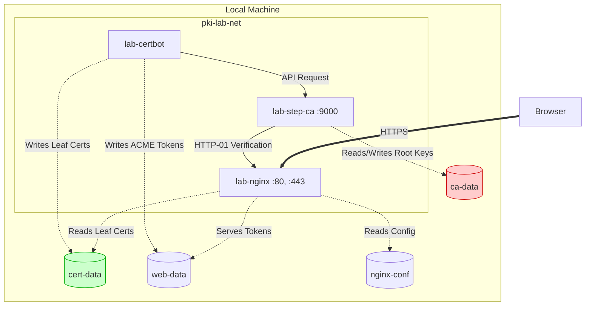
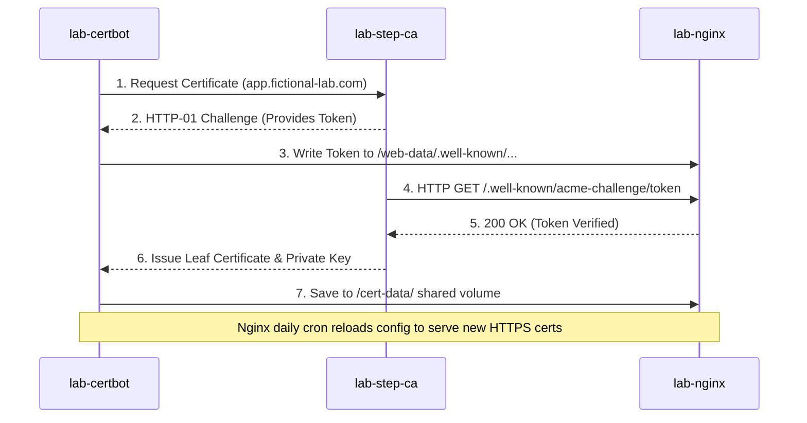

# Lab: Automated Enterprise PKI and Zero-Touch TLS Architecture

**Repo:** https://github.com/Arthur-K-99/labs/tree/main/General/pki-acme-lab

## 1. Executive Summary

**Objective:** Deploy a local Public Key Infrastructure (PKI) utilizing an ACME-compliant Certificate Authority to completely automate the provisioning, installation, and lifecycle management of TLS certificates for internal infrastructure.

**The Problem:** In enterprise environments, manual certificate management is a primary driver of service outages. Relying on human intervention to track expiration dates, generate Certificate Signing Requests (CSRs), and manually install keys on web servers inevitably leads to expired certificates and network downtime. Furthermore, while Public CAs (like Let's Encrypt) offer automation, they cannot be used to secure isolated, internal network segments due to strict public DNS validation requirements and the mandatory public disclosure of hostnames in Certificate Transparency (CT) logs.

**The Solution:** This architecture implements a self-hosted, Private Certificate Authority (`step-ca`) running within a Dockerized environment. By pairing this Private CA with an automated ACME client (`certbot`) and a standard web server (`nginx`), the environment creates a self-healing encryption pipeline. Certificates are automatically negotiated via HTTP-01 challenges, installed, and continuously renewed before expiration, achieving a "zero-touch" operational state for internal HTTPS traffic.



---

## 2. Core Cryptographic Concepts

Understanding the underlying mechanics is critical before deploying the infrastructure. This lab relies heavily on modern encryption standards and automated validation protocols.

### The Chain of Trust

Certificates do not operate in isolation; they rely on a strict hierarchical trust model.

- **Root CA:** The ultimate anchor of trust. It is self-signed, highly guarded, and its public key must be explicitly installed into a client device's "Trust Store" (e.g., the local operating system or browser). If the Root CA expires or is untrusted, the entire chain fails.
- **Intermediate CA:** To protect the Root CA from network exposure, it signs an Intermediate CA, which handles the day-to-day issuance of certificates.
- **Leaf Certificate (End-Entity):** The actual certificate loaded onto the web server, firewall, or load balancer. It actively encrypts the network traffic and typically has a short lifespan (e.g., 90 days).

### Public vs. Private Trust

- **Public CAs (DigiCert, Let's Encrypt):** Trusted globally out-of-the-box by all major operating systems. Used exclusively for public-facing assets. Every issued certificate is publicly logged, exposing the server's hostname to the internet.
- **Private CAs (step-ca, Microsoft AD CS):** Trusted only by devices within the organization that have been explicitly configured to accept them via IT policy. Used to secure internal applications, databases, and management interfaces without leaking infrastructure mapping to the outside world.

### The ACME Protocol & HTTP-01 Challenge

The Automated Certificate Management Environment (ACME) protocol eliminates the need for manual CSR generation.

1.  The client (Certbot) requests a certificate for a specific hostname (e.g., `app.fictional-lab.com`).
2.  The CA issues an **HTTP-01 Challenge**, providing a unique cryptographic token.
3.  The client places this token on the web server at a highly specific URL path (`/.well-known/acme-challenge/`).
4.  The CA reaches out over the network to verify the token exists at that URL. Once verified, the CA issues the Leaf Certificate.

### Separation of Duties (Data Architecture)

This lab enforces a strict physical separation of cryptographic assets:

- **`ca-data/`:** The highly secure identity provider. Contains the Root and Intermediate private keys. In a production environment, this data is often backed by Hardware Security Modules (HSMs) or kept entirely offline.
- **`cert-data/`:** The ephemeral working directory. Contains the short-lived Leaf Certificates utilized by the web server to negotiate TLS 1.2/1.3 sessions.

---

## 3. Lab Architecture & Environment Setup

This environment utilizes containerization to simulate a multi-server enterprise architecture on a single host machine.

### 3.1 Network Topology & Container Roles

The lab operates on an isolated Docker bridge network (`pki-lab-net`).

1.  **`lab-step-ca`:** The Private Certificate Authority. It holds the cryptographic identity of the organization and listens on port `9000` to serve ACME challenges and issue certificates.
2.  **`lab-nginx`:** The application web server. It listens on ports `80` (HTTP) and `443` (HTTPS) and relies on the CA for its cryptographic identity.
3.  **`lab-certbot`:** The automation agent. It acts as the intermediary, running on a scheduled loop to negotiate with `lab-step-ca` on behalf of `lab-nginx`.

### 3.2 Directory Structure & Persistent Storage

To ensure cryptographic keys survive container restarts and can be securely shared between isolated services, we must map specific local directories into the containers.

Open a terminal and execute the following to create the foundational structure:

```bash
mkdir -p ~/labs/pki-acme-lab/{ca-data,web-data,cert-data,nginx-conf}
cd ~/labs/pki-acme-lab
```

- **`ca-data/`:** Mapped to `step-ca`. Stores the Root and Intermediate CAs.
- **`cert-data/`:** Shared between `certbot` and `nginx`. Certbot writes the newly minted leaf certificates here; Nginx reads them to encrypt traffic.
- **`web-data/`:** Shared between `certbot` and `nginx`. Used to serve the `index.html` and temporarily host the HTTP-01 verification tokens.
- **`nginx-conf/`:** Stores the Nginx routing and TLS configuration files.

### 3.3 Defining the CA Identity

Enterprise CAs embed organizational data directly into the Root Certificate. In the `docker-compose.yml` file, we pass environment variables to `step-ca` to define a secure, isolated identity. To ensure this lab environment remains distinct from any real-world production or personal data, we utilize a fictional organizational profile:

- **Organization:** Fictional Lab Corp
- **Provisioner:** admin
- **DNS Names:** step-ca, localhost

---

## 4. Phase 1: Bootstrapping the Certificate Authority

With the architecture planned, the first operational phase is to initialize the central trust anchor.

### 4.1 Deploying the Base Infrastructure

Create the `docker-compose.yml` file in the root of your `pki-acme-lab` directory. This initial deployment brings the CA online.

```yml
services:
  step-ca:
    image: smallstep/step-ca:latest
    container_name: lab-step-ca
    environment:
      - DOCKER_STEPCA_INIT_NAME=Fictional Lab Root CA
      - DOCKER_STEPCA_INIT_DNS_NAMES=step-ca,localhost
      - DOCKER_STEPCA_INIT_PROVISIONER_NAME=admin
      - DOCKER_STEPCA_INIT_PASSWORD=password123
    volumes:
      - ./ca-data:/home/step
    ports:
      - "9000:9000"
    networks:
      - pki-lab-net
    restart: unless-stopped

  web-server:
    image: nginx:alpine
    container_name: lab-nginx
    volumes:
      - ./web-data:/usr/share/nginx/html
      - ./nginx-conf:/etc/nginx/conf.d
      - ./cert-data:/etc/letsencrypt
    ports:
      - "80:80"
      - "443:443"
    networks:
      pki-lab-net:
        aliases:
          - app.fictional-lab.com
    depends_on:
      - step-ca
    restart: unless-stopped

  certbot:
    image: certbot/certbot
    container_name: lab-certbot
    volumes:
      - ./cert-data:/etc/letsencrypt
      - ./web-data:/usr/share/nginx/html
    networks:
      - pki-lab-net
    profiles:
      - tools

networks:
  pki-lab-net:
    driver: bridge
```

Execute the deployment:

```bash
docker compose up -d step-ca
```

_Note: Upon its first execution, the `step-ca` container detects an empty `/home/step` volume, automatically generates a new 2048-bit or 4096-bit Root private key, and writes the `root_ca.crt` to your local `./ca-data` directory._

### 4.2 Establishing Local Machine Trust (The Crucial Step)

At this stage, the CA exists, but your local operating system does not know who "Fictional Lab Corp" is. If you attempt to connect to any service secured by this CA, your browser will trigger a strict `ERR_CERT_AUTHORITY_INVALID` security block.

To resolve this, you must manually inject the Root CA into your host machine's Trust Store, simulating the endpoint management systems (like Microsoft Intune or Group Policy) used in large corporate networks.

1.  Locate the generated Root Certificate at: `~/labs/pki-acme-lab/ca-data/certs/root_ca.crt`
2.  **macOS:** Double-click the file to open Keychain Access. Drag it into the **System** keychain. Double-click the imported certificate, expand the "Trust" section, and explicitly set "When using this certificate" to **Always Trust**.
3.  **Windows:** Double-click the file, click **Install Certificate**, select **Local Machine**, and place it directly into the **Trusted Root Certification Authorities** store.
4.  **Linux (Ubuntu/Debian):**

```bash
    sudo cp ca-data/certs/root_ca.crt /usr/local/share/ca-certificates/fictional-lab-root.crt
    sudo update-ca-certificates
```

---

## 5. Phase 2: Staging the Web Environment & DNS Routing

Before the ACME client can request a certificate, the web server must be reachable via a Fully Qualified Domain Name (FQDN). In an enterprise environment, this would involve configuring internal DNS servers. For this local lab, we will manipulate the host machine's DNS resolution and configure a basic, unencrypted web server to catch the validation challenge.

### 5.1 Bypassing the "Localhost" Docker Trap

A common pitfall in containerized PKI labs is attempting to issue a certificate for `localhost`. Because containers have isolated network stacks, when the `step-ca` container attempts to verify `http://localhost`, it queries its own loopback interface rather than the Nginx container, causing the validation to hang and fail.

To resolve this, we utilize a realistic internal domain: `app.fictional-lab.com`.

**Action:** Update your local machine's DNS routing by appending the following line to your `/etc/hosts` file (requires administrative/sudo privileges):

```powershell
127.0.0.1   app.fictional-lab.com
```

_(Note: Our `docker-compose.yml` file already mapped this alias to the `lab-nginx` container within the internal Docker network)._

### 5.2 Configuring Nginx for the HTTP-01 Challenge

The web server must be running on port 80 (HTTP) to answer the CA's challenge before it can obtain the cryptographic keys required to listen on port 443 (HTTPS).

**Action:** Create the initial `default.conf` inside `~/labs/pki-acme-lab/nginx-conf/`:

```Nginx
server {
    listen 80;
    listen [::]:80;
    server_name app.fictional-lab.com;

    # 1. ACME Challenge Routing
    # Directs step-ca to the specific directory where Certbot places the token
    location /.well-known/acme-challenge/ {
        root /usr/share/nginx/html;
        allow all;
    }

    # 2. Standard Web Traffic
    location / {
        try_files $uri $uri/ =404;
    }
}
```

**Action:** Create a dummy `index.html` payload to serve as visual confirmation that the server is active:

```Bash
echo "<h1>Welcome to the Fictional Lab Secure Server</h1>" > ~/labs/pki-acme-lab/web-data/index.html
```

**Action:** Boot the web server alongside the CA:

```Bash
docker compose up -d web-server
```

Verify the unencrypted site is reachable by navigating to `http://app.fictional-lab.com`.

---

## 6. Phase 3: Executing the ACME Workflow

With the infrastructure running and DNS correctly routed, we transition to automating the certificate issuance.



### 6.1 Enabling the ACME Provisioner

By default, `step-ca` requires explicit configuration to enable the ACME protocol.

**Action:** Execute the following command to add the ACME provisioner to your active CA, then restart the container to apply the configuration. _(If prompted for a password, utilize the `DOCKER_STEPCA_INIT_PASSWORD` defined in the compose file)._

```Bash
docker compose exec step-ca step ca provisioner add acme --type ACME
docker compose restart step-ca
```

### 6.2 Triggering the Certificate Negotiation

We will now execute a one-time, ephemeral instance of the Certbot container to fetch the certificate.

Because Certbot communicates with the CA over an encrypted HTTPS API, Certbot must trust the "Fictional Lab Root CA". We achieve this by mapping the `root_ca.crt` directly into the container's trusted certificate store at runtime.

**Action:** Execute the automated ACME request:

```Bash
docker compose run --rm \
  -v $(pwd)/ca-data/certs/root_ca.crt:/etc/ssl/certs/root_ca.crt \
  -e REQUESTS_CA_BUNDLE=/etc/ssl/certs/root_ca.crt \
  certbot certonly \
  --webroot -w /usr/share/nginx/html \
  -d app.fictional-lab.com \
  --email admin@fictional-lab.com \
  --agree-tos \
  --no-eff-email \
  --server https://step-ca:9000/acme/acme/directory
```

**The Automated Workflow (Under the Hood):**

1. **Request:** Certbot contacts `step-ca` asking for a certificate for `app.fictional-lab.com`.
2. **Challenge:** `step-ca` provides a cryptographic token.
3. **Fulfillment:** Certbot writes the token to `./web-data/.well-known/acme-challenge/`.
4. **Verification:** `step-ca` queries `http://app.fictional-lab.com/.well-known/...`. The Nginx routing configuration catches this request and serves the token.
5. **Issuance:** The verification succeeds. The Private CA mints the TLS leaf certificate and private key, and Certbot deposits them into the `./cert-data/` directory.

## 7. Phase 4: Securing the Web Server (Modern TLS)

Now that the cryptographic keys have been generated and stored in the shared volume, the web server must be reconfigured to utilize them. This phase upgrades the connection from standard HTTP to encrypted HTTPS, enforcing modern cipher suites.

### 7.1 Upgrading the Nginx Configuration

We must rewrite the Nginx routing rules to perform two primary functions: unconditionally redirect insecure traffic to the secure port, and terminate the TLS connection using the newly minted leaf certificates.

**Action:** Open `~/labs/pki-acme-lab/nginx-conf/default.conf` and replace the contents entirely with the following configuration:

```nginx
server {
    # 1. Catch HTTP traffic and redirect to HTTPS
    listen 80;
    listen [::]:80;
    server_name app.fictional-lab.com;

    # Keep the ACME challenge path open on port 80 for future automated renewals
    location /.well-known/acme-challenge/ {
        root /usr/share/nginx/html;
        allow all;
    }

    # Redirect all other HTTP traffic to HTTPS
    location / {
        return 301 https://$host$request_uri;
    }
}

server {
    # 2. Serve HTTPS traffic using our new certificates
    listen 443 ssl;
    listen [::]:443 ssl;
    server_name app.fictional-lab.com;

    # Point to the Let's Encrypt/Certbot directory mapped in the docker-compose volume
    ssl_certificate /etc/letsencrypt/live/app.fictional-lab.com/fullchain.pem;
    ssl_certificate_key /etc/letsencrypt/live/app.fictional-lab.com/privkey.pem;

    # Enforce Modern TLS settings (Disabling obsolete SSLv3, TLS 1.0, and 1.1)
    ssl_protocols TLSv1.2 TLSv1.3;
    ssl_ciphers HIGH:!aNULL:!MD5;

    root /usr/share/nginx/html;
    index index.html;

    location / {
        try_files $uri $uri/ =404;
    }
}
```

### 7.2 Applying the Cryptographic State

Nginx loads certificates into active memory at startup. To apply these changes without dropping active network connections, we execute a graceful reload.

**Action:** Execute the reload command within the running container:

```Bash
docker compose exec web-server nginx -s reload
```

**Verification:** Navigate to `http://app.fictional-lab.com` in your browser. You should immediately be redirected to `https://`, accompanied by a secure padlock icon indicating the connection is fully encrypted and trusted by your local "Fictional Lab Root CA".

---

## 8. Phase 5: Enterprise Automation (Zero-Touch Renewals)

The current state is secure, but temporary. ACME certificates are short-lived. To achieve true operational resilience and prevent future outages, the infrastructure must be configured to self-heal.

### 8.1 Automating the ACME Client Loop

The Certbot container must transition from a one-time execution tool to a persistent background service.

**Action:** Open your `docker-compose.yml` file and update the `certbot` and `web-server` service definitions.

1. **Modify Certbot:** Add an entrypoint that forces the container to wake up every 12 hours, check the certificate's expiration window, and execute a renewal only if it is within 30 days of expiring.
2. **Modify Nginx:** Because Certbot runs in an isolated container, Nginx is unaware when files on the hard drive change. We must instruct Nginx to reload its configuration daily to ensure it is always serving the freshest certificate from memory.

Replace the respective blocks with these updated configurations:

```YAML
  certbot:
    image: certbot/certbot
    container_name: lab-certbot
    volumes:
      - ./cert-data:/etc/letsencrypt
      - ./web-data:/usr/share/nginx/html
    networks:
      - pki-lab-net
    # Continuous loop: Wake up every 12 hours and attempt renewal
    entrypoint: "/bin/sh -c 'trap exit TERM; while :; do certbot renew; sleep 12h & wait $${!}; done;'"
    restart: unless-stopped

  web-server:
    image: nginx:alpine
    container_name: lab-nginx
    volumes:
      - ./web-data:/usr/share/nginx/html
      - ./nginx-conf:/etc/nginx/conf.d
      - ./cert-data:/etc/letsencrypt
    ports:
      - "80:80"
      - "443:443"
    networks:
      pki-lab-net:
        aliases:
          - app.fictional-lab.com
    depends_on:
      - step-ca
    # Override command: Start nginx AND run a daily reload loop to catch new certs
    command: "/bin/sh -c 'while :; do sleep 24h & wait $${!}; nginx -s reload; done & nginx -g \"daemon off;\"'"
    restart: unless-stopped
```

**Action:** Apply the persistent automation state:

```Bash
docker compose up -d
```

The architecture is now fully autonomous.

---

## 9. Operational Scenarios & Troubleshooting (Chaos Testing)

To fully validate the architecture, it is essential to observe system behavior during failure states.

### 9.1 Simulating Global Trust Failure (Root CA Expiration)

If a Root CA expires or is compromised, the entire chain collapses. To simulate this global event locally:

1. Open your host machine's OS Trust Store (Keychain Access on macOS, Certificate Manager on Windows).
2. Locate and delete the `Fictional Lab Root CA`.
3. Completely restart your web browser (to clear its local cache) and navigate to `https://app.fictional-lab.com`.
4. **Result:** The browser will throw a hard `ERR_CERT_AUTHORITY_INVALID` error, aggressively blocking access. This mimics the exact behavior endpoints exhibit when enterprise trust anchors fail or during man-in-the-middle attacks.

### 9.2 Log Analysis for ACME Failures

If the automated renewal loop fails, the issue is typically a breakdown in network routing preventing the HTTP-01 challenge from completing.

- **Check CA Logs:** `docker compose logs step-ca` (Look for failed DNS lookups or challenge rejections).
- **Check Certbot Logs:** `docker compose logs certbot` (Review the detailed output of the ACME negotiation).
- **Check Web Server Logs:** `docker compose logs web-server` (Verify that `step-ca` successfully hit the `/.well-known/acme-challenge/` path with a `200 OK` status).
