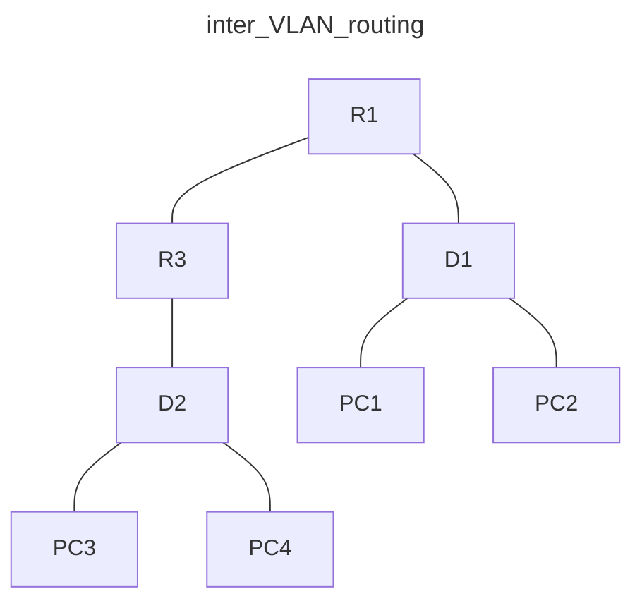

## Topology

![[Pasted image 20241123094119.png]]
![[Pasted image 20241202220809.png]]


## Addressing Table

| Device | Interface | IPv4 Address  | IPv6 Address              | IPv6 Link-Local |
| ------ | --------- | ------------- | ------------------------- | --------------- |
| R1     | G0/0/1    | 10.1.13.1/24  | 2001:db8:acad:10d1::1/64  | fe80::1:1       |
| R1     | S0/1/1    | 10.1.3.1/24   | 2001:db8:acad:1013::1/64  | fe80::1:2       |
| D1     | G1/0/11   | 10.1.13.13/24 | 2001:db8:acad:10d1::d1/64 | fe80::d1:1      |
| D1     | VLAN50    | 10.2.50.1/24  | 2001:db8:acad:1050::d1/64 | fe80::d1:2      |
| D1     | VLAN60    | 10.2.60.1/24  | 2001:db8:acad:1060::d1/64 | fe80::d1:3      |
| R3     | S0/1/1    | 10.1.3.3/24   | 2001:db8:acad:1013::3/64  | fe80::3:1       |
| R3     | G0/0/1.75 | 10.3.75.1/24  | 2001:db8:acad:3075::1/64  | fe80::3:2       |
| R3     | G0/0/1.85 | 10.3.85.1/24  | 2001:db8:acad:3085::1/64  | fe80::3:3       |
| D2     | VLAN75    | 10.3.75.14/24 | 2001:db8:acad:3075::d2/64 | fe80::d2:1      |
| PC1    | NIC       | 10.2.50.50/24 | 2001:db8:acad:1050::50/64 | EUI-64          |
| PC2    | NIC       | 10.2.60.50/24 | 2001:db8:acad:1060::50/64 | EUI-64          |
| PC3    | NIC       | 10.3.75.50/24 | 2001:db8:acad:3075::50/64 | EUI-64          |
| PC4    | NIC       | 10.3.85.50/24 | 2001:db8:acad:3085::50/64 | EUI-64          |




## Objectives
Part 1: Build the Network and Configure Basic Device Settings

Part 2: Configure and Verify Inter-VLAN Routing on a Layer 3 Switch

Part 3: Configure and Verify Router-based Inter-VLAN Routing

Part 4: Examine CAM and CEF Details

# Background / Scenario

The methods used to move packets and frames from one interface to the next has changed over the years. In this lab you will configure Inter-VLAN Routing in its various forms and then examine the different tables used in making forwarding decisions.

**Note**: This lab is an exercise in configuring and verifying various methods of Inter-VLAN routing and does not reflect networking best practices.

**Note**: The routers and switches used with CCNP hands-on labs are Cisco 4221 and Cisco 3650, both with Cisco IOS XE Release 16.9.4 (universalk9 image). Other routers and Cisco IOS versions can be used. Depending on the model and Cisco IOS version, the commands available and the output produced might vary from what is shown in the labs.

**Note**: Ensure that the routers and switches have been erased and have no startup configurations. If you are unsure contact your instructor.

# Instructions

## Part 1: Build the Network and Configure Basic Device Settings

In Part 1, you will set up the network topology and configure basic settings.

### Step 1: Cable the network as shown in the topology.

Attach the devices as shown in the topology diagram, and cable as necessary.

### Step 2: Configure basic settings for each device.

1. Console into each router, enter global configuration mode, and apply the basic settings using the following startup configurations.

Router R1 Sample
```bash
no ip domain lookup 
hostname R1
line con 0
 exec-timeout 0 0
 logging synchronous
 exit
banner motd # This is R1, Inter-VLAN Routing Lab #
```

2. Set the clock on each device to UTC time.

3. Save the running configuration to startup-config.

## Part 2: Configure and Verify Inter-VLAN Routing on a Layer 3 Switch

In Part 2, you will configure and verify inter-VLAN Routing on a Layer 3 switch. For this part, you will focus on the configuration of switch D1 and router R1.

**Note:** The default Switch Database Manager (SDM) template on a Catalyst 3650 running IOS XE supports dual-stacked operations and requires no additional configuration for our purposes.

If you are using an alternate device running Cisco IOS, check the SDM template with the privileged EXEC command **show sdm prefer** and verify that the ‘number of IPv6 unicast routes’ supported is not zero.

If it is zero, you must change the SDM template to one that supports IPv6 using the **sdm prefer** _template_name_ global configuration command. The template name will vary depending on the IOS version. Changing the template will require a reboot.

### Step 1: On D1, configure Inter-VLAN Routing.

Open configuration window

1. Configure D1 to support IP routing and IPv6 unicast routing.

```bash
D1(config)# ip routing
D1(config)# ipv6 unicast-routing
```

2. Create the VLANs and name them as specified in the topology.

```bash
D1(config)# vlan 50
D1(config-vlan)# name Group50
D1(config-vlan)# exit
D1(config)# vlan 60
D1(config-vlan)# name Group60
D1(config-vlan)# exit
```

3. Assign the e0/2 to VLAN 50 and e0/3 to VLAN 60.

```bash
D1(config)# interface e0/2
D1(config-if)# switchport mode access
D1(config-if)# switchport access vlan 50
D1(config-if)# no shutdown
D1(config-if)# exit
D1(config)# interface e0/3
D1(config-if)# switchport mode access
D1(config-if)# switchport access vlan 60
D1(config-if)# no shutdown
D1(config-if)# exit
```

4. Create the Switched Virtual Interfaces (SVI) that will support VLAN 50 and VLAN 60.

```bash
D1(config)# interface vlan 50
D1(config-if)# ip address 10.2.50.1 255.255.255.0
D1(config-if)# ipv6 address fe80::d1:2 link-local
D1(config-if)# ipv6 address 2001:db8:acad:1050::d1/64
D1(config-if)# no shutdown
D1(config-if)# exit
D1(config)# interface vlan 60
D1(config-if)# ip address 10.2.60.1 255.255.255.0
D1(config-if)# ipv6 address fe80::d1:3 link-local
D1(config-if)# ipv6 address 2001:db8:acad:1060::d1/64
D1(config-if)# no shutdown
D1(config-if)# exit
```

5. Configure PC1 with the addresses specified in the Addressing Table. Further assign default gateways of 10.2.50.1 and 2001:db8:acad:1050::d1.

Many ways to do it depending on your chosen platform. As I use containerlab and alpine linux for this lab, I added the following on the \*.clab.yml where the linux node is defined:

```
...
exec:
	- ip addr add 10.2.50.50/24 dev eth1
	- ip route add default via 10.2.50.1 dev eth1
	- ip -6 addr add 2001:db8:acad:1050::50/64 dev eth1
	- ip -6 route add default via 2001:db8:acad:1050::d1 dev eth1
...
```

6. Configure PC2 with the addresses specified in the Addressing Table. Further assign default gateways of 10.2.60.1 and 2001:db8:acad:1060::d1.

Similar to **5.**

7. From PC1, ping PC2’s IPv4 and IPv6 address. Success indicates that D1 is performing Inter-VLAN Routing.

8. Examine the MAC address table on D1 with the command **show mac address-table dynamic**. You should see PC1 and PC2’s mac addresses listed with the ports they are connected to.

```bash
D1#show mac address-table
          Mac Address Table
-------------------------------------------

Vlan    Mac Address       Type        Ports
----    -----------       --------    -----
  50    aac1.abba.1f49    DYNAMIC     Et0/2
  60    aac1.ab0a.58ed    DYNAMIC     Et0/3
Total Mac Addresses for this criterion: 2
```

### Step 2: On D1, configure a routed port and default routes towards R1

1. Configure interface e0/1 as a routed port with addressing as specified in the topology diagram.
```bash
D1(config)# interface e0/1
D1(config-if)# no switchport
D1(config-if)# ip address 10.1.13.13 255.255.255.0
D1(config-if)# ipv6 address fe80::d1:1 link-local
D1(config-if)# ipv6 address 2001:db8:acad:10d1::d1/64
D1(config-if)# no shutdown
D1(config-if)# exit
```

2. Verify that interface G1/0/11 is no longer associated with the VLAN database by issuing the command **show vlan brief | i e0/1. There should be no output.
   
3. Configure static default routes for IPv4 and IPv6 that point towards the interface address at R1.
```bash
D1(config)# ip route 0.0.0.0 0.0.0.0 10.1.13.1
D1(config)# ipv6 route ::/0 2001:db8:acad:10d1::1
```
You may see the error message **%ADJ-3-RESOLVE_REQ: Adj resolve request: Failed to resolve 10.1.13.1**. This indicates that the switch sent an ARP for the MAC address of 10.1.13.1 and got no reply. We will configure that next.

### Step 3: On R1, configure interface addressing and static routing.

1. Configure R1 to support IPv6 unicast routing.

```bash
R1(config)# ipv6 unicast-routing
```

2. Configure the interfaces on R1 with the addresses specified in the Addressing Table. **TODO**

```bash
R1(config)# interface g0/0/1
R1(config-if)# ip address 10.1.13.1 255.255.255.0
R1(config-if)# ipv6 address fe80::1:1 link-local
R1(config-if)# ipv6 address 2001:db8:acad:10d1::1/64
R1(config-if)# no shutdown
R1(config-if)# exit
R1(config)# interface s0/1/1
R1(config-if)# ip address 10.1.3.1 255.255.255.0
R1(config-if)# ipv6 address fe80::1:2 link-local
R1(config-if)# ipv6 address 2001:db8:acad:1013::1/64
R1(config-if)# no shutdown
R1(config-if)# exit
```

c.     Configure routing on R1. Configure static routes to the networks supported by D1 and a default route for everything else point at R3.

R1(config)# **ip route 10.2.0.0 255.255.0.0 10.1.13.13**

R1(config)# **ipv6 route 2001:db8:acad:1050::/64 2001:db8:acad:10d1::d1**

R1(config)# **ipv6 route 2001:db8:acad:1060::/64 2001:db8:acad:10d1::d1**

R1(config)#

R1(config)# **ip route 0.0.0.0 0.0.0.0 10.1.3.3**

R1(config)# **ipv6 route ::/0 2001:db8:acad:1013::3**

R1(config)#

d.     From R1, ping PC2 with IPv4 and IPv6. All pings should be successful.