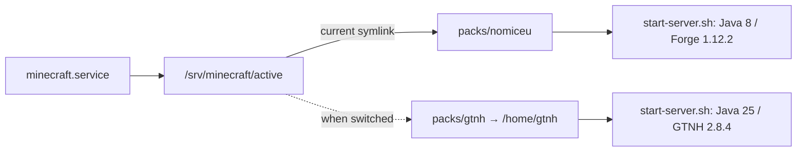

# Multi-Modpack Minecraft Server

> [!info] Live audit
> This page documents the server as inspected on **August 23, 2026**. The server was inspected over SSH without changing or restarting it.

The Oracle Cloud instance originally hosted only GregTech: New Horizons (GTNH). It is now a small multi-modpack platform. GTNH is still installed, but Nomifactory CEu is currently selected and running.

## Current state

| Item                  | Live value                                               |
| --------------------- | -------------------------------------------------------- |
| Host                  | `gtnh-instance` at `129.213.126.1`                       |
| OS                    | Ubuntu 24.04 on ARM64                                    |
| Capacity              | 4 OCPU, 23 GiB RAM, 100 GB boot volume                   |
| Disk use during audit | 26 GB used, 71 GB available                              |
| Service account       | `gtnh`                                                   |
| Service to operate    | `minecraft.service`                                      |
| Active pack           | `nomiceu`                                                |
| Active pack directory | `/srv/minecraft/packs/nomiceu`                           |
| Game port             | TCP `25565`                                              |
| RCON port             | TCP `25575`, restricted to loopback by the host firewall |

The active process is Nomifactory CEu 1.7.7 in Normal Mode, using Forge 1.12.2 and Java 8. It has been running through `minecraft.service` since July 26, 2026.

## How pack selection works



`minecraft.service` does not contain pack-specific Java arguments. Its working directory is the `/srv/minecraft/active` symbolic link, and it runs `start-server.sh` from whichever pack that link selects.

Two files record the selection:

- `/srv/minecraft/active` is a symbolic link to the selected pack directory.
- `/srv/minecraft/active-pack` contains the selected pack name as text.

Installed packs:

| Pack name | Storage                                    | Version and mode                   | World directory | Runtime                                 | State    |
| --------- | ------------------------------------------ | ---------------------------------- | --------------- | --------------------------------------- | -------- |
| `nomiceu` | `/srv/minecraft/packs/nomiceu`             | Nomifactory CEu 1.7.7, Normal Mode | `world`         | Java 8, `-Xms8G -Xmx16G`, G1GC          | Active   |
| `gtnh`    | `/srv/minecraft/packs/gtnh` → `/home/gtnh` | GTNH 2.8.4                         | `World`         | Temurin Java 25, `-Xms16G -Xmx20G`, ZGC | Inactive |

Linux paths are case-sensitive. Nomifactory's world is `world`; GTNH's world is `World`.

## What changed on July 26, 2026

File timestamps and the live configuration reconstruct the conversion:

1. At 14:14, the existing GTNH installation was preserved as `/home/gtnh/cold-archives/GTNH-cold-2026-07-26-14-14-10.tar.gz`.
2. At 14:19, `/srv/minecraft/packs` and the generic `minecraft.service` were created. GTNH was registered by linking `/srv/minecraft/packs/gtnh` to its original `/home/gtnh` directory.
3. At 14:47, `mc-switch` and `mc-backup` were installed.
4. At 14:49, the legacy `gtnh.service` received an additional guard so it cannot be started accidentally.
5. At 15:15, the `mc-console` wrapper and RCON firewall automation were installed.
6. At 15:29, `nomiceu` was selected. `/srv/minecraft/active` was linked to its pack directory and the generic service started it.

GTNH was therefore not deleted or overwritten. Its original directory remains intact and is one of the selectable packs.

## Connecting

Connect as the administrative `ubuntu` account:

```bash
ssh minecraft-server
```

The SSH alias should resolve to this shape:

```sshconfig
Host minecraft-server
  HostName 129.213.126.1
  User ubuntu
  IdentityFile ~/.ssh/main
  IdentitiesOnly yes
```

The private key must not be readable by other users:

```bash
chmod 600 ~/.ssh/main
```

> [!warning] Workstation issue found during the audit
> The inspected `~/.ssh/config` pointed `IdentityFile` at `~/.ssh/public_keys/minecraft-server.pub`. That is a public key and SSH rejected it as an identity file. The audit connected successfully with the existing private key at `~/.ssh/main`. Correct the alias if `ssh minecraft-server` fails the same way.

The `ubuntu` account administers the OS with `sudo`. The unprivileged `gtnh` account owns and runs both packs. Do not run Minecraft as `ubuntu` or root.

## Day-to-day operations

### Check what is active

```bash
sudo cat /srv/minecraft/active-pack
sudo readlink -f /srv/minecraft/active
sudo systemctl status minecraft.service
```

The marker and symbolic link should name the same pack. The service's Java process should have the selected pack as its working directory.

### Check players and use the server console

RCON is accessed locally through the `mc-console` wrapper:

```bash
sudo mc-console list
sudo mc-console "say Server maintenance will begin shortly"
sudo mc-console "whitelist list"
```

Running `sudo mc-console` without a command opens an interactive RCON session.

The wrapper:

- Reads the active pack from `/srv/minecraft/active-pack`.
- Reads the matching root-only secret from `/etc/minecraft/rcon`.
- Connects `mcrcon` to `127.0.0.1:25575`.
- Never requires the operator to type or expose the RCON password.

The audit verified `sudo mc-console list` against the running Nomifactory server.

### Switch packs

First confirm that nobody is online, then run one of the following:

```bash
sudo mc-console list
sudo mc-switch gtnh
```

or:

```bash
sudo mc-console list
sudo mc-switch nomiceu
```

Switching is disruptive. `mc-switch` performs these actions in order:

1. Validates the requested pack name and its executable `start-server.sh`.
2. Stops `minecraft.service` cleanly.
3. Runs `mc-backup` for the pack being switched off.
4. Creates and tests a ZIP of that pack's world, then prints its size and SHA-256 checksum.
5. Replaces `/srv/minecraft/active` atomically and updates `/srv/minecraft/active-pack`.
6. Starts `minecraft.service` with the newly selected pack.

Verify the result:

```bash
sudo cat /srv/minecraft/active-pack
sudo systemctl status minecraft.service
sudo journalctl -u minecraft.service -n 100 --no-pager
sudo mc-console list
```

> [!danger] Do not operate the legacy service
> Do not start, stop, enable, or restart `gtnh.service`. It is disabled and guarded by `/etc/systemd/system/gtnh.service.d/disabled.conf`. All packs, including GTNH, are operated through `minecraft.service` and `mc-switch`.

### View logs

The service journal works regardless of which pack is active:

```bash
sudo journalctl -u minecraft.service -n 200 --no-pager
sudo journalctl -u minecraft.service -f
```

Pack-local logs are stored here:

- Nomifactory: `/srv/minecraft/packs/nomiceu/logs`
- GTNH: `/home/gtnh/logs`

## Custom tools and service files

These are the locally created components that turn the old GTNH installation into a multi-pack server:

| Component                                                    | Purpose                                                                                                                             |
| ------------------------------------------------------------ | ----------------------------------------------------------------------------------------------------------------------------------- |
| `/usr/local/sbin/mc-switch`                                  | Stops the generic service, cold-backs up the current world, changes the active link, and starts the requested pack.                 |
| `/usr/local/sbin/mc-backup`                                  | Creates a compressed world backup after confirming no Minecraft Java process is running; validates the ZIP and prints its checksum. |
| `/usr/local/sbin/mc-console`                                 | Selects the active pack's RCON secret and wraps `mcrcon` for local console access.                                                  |
| `/usr/local/sbin/mc-rcon-firewall`                           | Adds IPv4 and IPv6 rules that allow RCON from loopback and drop all non-loopback RCON traffic.                                      |
| `/etc/systemd/system/minecraft.service`                      | Generic service that starts `/srv/minecraft/active/start-server.sh` as `gtnh`.                                                      |
| `/etc/systemd/system/minecraft-rcon-firewall.service`        | Applies the RCON firewall before Minecraft starts.                                                                                  |
| `/etc/systemd/system/minecraft.service.d/rcon-firewall.conf` | Makes the firewall service a required dependency of Minecraft.                                                                      |
| `/etc/systemd/system/gtnh.service.d/disabled.conf`           | Prevents accidental use of the obsolete pack-specific service.                                                                      |
| `<pack>/start-server.sh`                                     | Pack-specific Java executable, memory, garbage collector, Forge JAR, and launch arguments.                                          |
| `<pack>/push-backups.sh`                                     | Pack-specific Google Drive upload and retention logic.                                                                              |

The generic service is enabled at boot and restarts only after failures. It runs as `gtnh:gtnh`, sends `SIGTERM` for clean shutdown, allows up to 180 seconds to stop, and waits 15 seconds before a failure restart.

## Backups

There are three distinct backup layers. Do not treat them as interchangeable.

### 1. Scheduled in-game world backups

Nomifactory's FTB Backups mod writes to:

```text
/srv/minecraft/packs/nomiceu/backups
```

Current settings:

- Backup every 0.5 hours, even with no players online.
- Keep 10 local backups.
- Maximum local backup set of 20 GB.
- Compression level 1.
- Force a backup on server shutdown.

GTNH's older scheduled backups remain in:

```text
/home/gtnh/backups
```

Because GTNH is inactive, that directory is not currently receiving new in-game backups.

### 2. Cold backups created during switching

`mc-switch` calls `mc-backup` only after the server stops. Archives are stored inside the pack being switched off:

```text
<pack>/switch-backups/<pack>-switch-YYYY-MM-DD-HH-MM-SS.zip
```

Only the world named by `level-name` in that pack's `server.properties` is included. The archive does not contain the pack's mods, configuration, launcher, service files, or RCON secret.

Before the multi-pack conversion, a one-time full GTNH archive was also created:

```text
/home/gtnh/cold-archives/GTNH-cold-2026-07-26-14-14-10.tar.gz
```

### 3. Google Drive uploads

The `gtnh` user's crontab contains two daily jobs:

| Time  | Local source                               | Google Drive destination                                    | Retention behavior                                                                                      |
| ----- | ------------------------------------------ | ----------------------------------------------------------- | ------------------------------------------------------------------------------------------------------- |
| 04:30 | `/home/gtnh/backups`                       | `gdrive:Backups/GTNH`                                       | Delete files older than 14 days only after a successful upload; always protect the newest remote file.  |
| 05:00 | Nomifactory `backups` and `switch-backups` | `gdrive:Backups/Nomifactory_CEu/scheduled` and `.../switch` | Copy, run `rclone check`, then delete files older than 14 days while protecting the newest remote file. |

The GTNH upload job still runs while GTNH is inactive. It rechecks the unchanged local backup set and performs remote retention, but it cannot create a new GTNH world backup.

Rclone configuration belongs to the service account and is stored under `/home/gtnh/.config/rclone`. Do not copy its contents into this documentation.

### Backup coverage gap

The recurring backups protect worlds, not the complete multi-pack platform. A full infrastructure recovery also needs:

- `/srv/minecraft`, excluding large world/backup data if those are restored separately.
- The GTNH pack at `/home/gtnh`.
- `/usr/local/sbin/mc-*`.
- The Minecraft systemd units and drop-ins under `/etc/systemd/system`.
- `/etc/minecraft/rcon`, transferred through a secure secrets channel.
- The `gtnh` user's Rclone configuration, transferred through a secure secrets channel.

The one-time GTNH cold archive is not a recurring infrastructure backup. Add a separate, encrypted configuration/infrastructure backup before assuming the instance can be rebuilt solely from Google Drive.

## Restore a world backup

The examples below restore the active pack. For an inactive pack, either switch to it first or carefully replace the active-pack paths with that pack's explicit directory.

1. Identify the active pack and world name:

   ```bash
   sudo cat /srv/minecraft/active-pack
   sudo grep '^level-name=' /srv/minecraft/active/server.properties
   ```

2. Stop the generic service:

   ```bash
   sudo systemctl stop minecraft.service
   ```

3. Test the chosen archive before changing the world:

   ```bash
   sudo unzip -t /path/to/backup.zip
   ```

4. Move the current world aside. Use `world` for Nomifactory or `World` for GTNH:

   ```bash
   sudo mv /srv/minecraft/active/world /srv/minecraft/active/world.before-restore
   ```

5. Extract as the service account into the active pack root:

   ```bash
   sudo -u gtnh unzip /path/to/backup.zip -d /srv/minecraft/active
   ```

6. Confirm ownership and start the service:

   ```bash
   sudo chown -R gtnh:gtnh /srv/minecraft/active/world
   sudo systemctl start minecraft.service
   sudo journalctl -u minecraft.service -n 100 --no-pager
   ```

7. After the restored world is verified in-game, decide whether to retain or remove `world.before-restore`.

For GTNH, substitute the case-sensitive `World` path throughout. Never remove `session.lock` unless the service is stopped and no Minecraft Java process exists.

## Adding another modpack

The switcher recognizes a directory name containing only letters, numbers, `_`, or `-`. A new pack must provide at least:

```text
/srv/minecraft/packs/<pack>/
├── start-server.sh       # executable
├── server.properties     # includes a safe level-name
├── eula.txt
├── mods and configuration
└── <world directory>
```

Operational requirements:

1. Everything in the pack directory must be owned by `gtnh:gtnh`.
2. `start-server.sh` must use `exec`, remain in the foreground, and end with `nogui` so systemd tracks the real Java process.
3. The pack must listen on game port `25565` and use RCON port `25575` if `mc-console` support is required.
4. `level-name` must contain only letters, numbers, `_`, `.`, or `-`; `mc-backup` deliberately rejects other values.
5. `mc-console` currently accepts only `gtnh` and `nomiceu`. Its allow-list and a root-only `/etc/minecraft/rcon/<pack>.password` file must be added for another pack.
6. Decide how the pack creates scheduled local backups and extend the Google Drive upload job. `mc-switch` supplies only a backup at switch time.
7. Confirm that the chosen Java build supports ARM64 and document pack-specific heap and garbage-collector settings.
8. Test the pack manually and verify its backup before relying on `mc-switch` in production.

Once those requirements are met, `sudo mc-switch <pack>` discovers the directory automatically; there is no central pack registry.

## Networking and security

Traffic crosses both the Oracle Cloud network policy and the Ubuntu host firewall.

- TCP `22`: SSH administration.
- TCP `25565`: Minecraft game traffic.
- TCP `25575`: The Java process listens on all interfaces, but `minecraft-rcon-firewall.service` permits only loopback and drops other IPv4 and IPv6 traffic.

Do not connect a desktop RCON client directly to the public IP. Use SSH and `sudo mc-console`. If an old Oracle Cloud ingress rule still exposes TCP `25575`, remove it; the host currently blocks it, but the cloud rule is unnecessary.

The live interface is `enp0s6`. Oracle's generated Netplan file requests MTU 9000, while `/etc/netplan/99-custom-mtu.yaml` overrides it to MTU 1500 with DHCP. The effective interface MTU observed during the audit was 1500.

## Troubleshooting

### Service will not start

```bash
sudo systemctl status minecraft.service
sudo journalctl -u minecraft.service -b --no-pager
sudo readlink -f /srv/minecraft/active
sudo cat /srv/minecraft/active-pack
sudo test -x /srv/minecraft/active/start-server.sh
```

The unit has `ConditionPathIsSymbolicLink=/srv/minecraft/active`, so a missing or non-symbolic active path prevents startup.

### Marker and link disagree

Do not edit either file while Minecraft is running. Confirm the intended pack, stop `minecraft.service`, and use `sudo mc-switch <pack>` so the backup and atomic link update are performed consistently.

### Switch backup fails

`mc-backup` refuses to proceed if any Java process owned by `gtnh` is running, if `server.properties` is missing, if `level-name` is unsafe, or if the world directory does not exist. Resolve the reported condition instead of bypassing the check.

### RCON fails

```bash
sudo systemctl status minecraft-rcon-firewall.service
sudo ls -l /etc/minecraft/rcon
sudo grep -E '^(enable-rcon|rcon.port)=' /srv/minecraft/active/server.properties
sudo mc-console list
```

Secret files should remain owned by root with mode `600`. Never print their contents into a terminal log or documentation.

## Audit notes and follow-ups

- Nomifactory CEu 1.7.7 was active and healthy; the console probe reported 0 of 20 players online.
- GTNH 2.8.4 remains selectable through `/srv/minecraft/packs/gtnh` and has an executable pack launcher. It was not started during the audit.
- `minecraft.service` and `minecraft-rcon-firewall.service` are enabled. `gtnh.service` is disabled and guarded.
- Nomifactory had 10 scheduled local backups totaling about 561 MB. GTNH retained about 15 GB of older scheduled world backups plus its 1.7 GB cold archive.
- The recurring Google Drive jobs cover world archives but not a complete rebuild of the switching platform.
- The workstation SSH alias needs its identity changed from the `.pub` file to `~/.ssh/main`.

**Last verified:** August 23, 2026.
